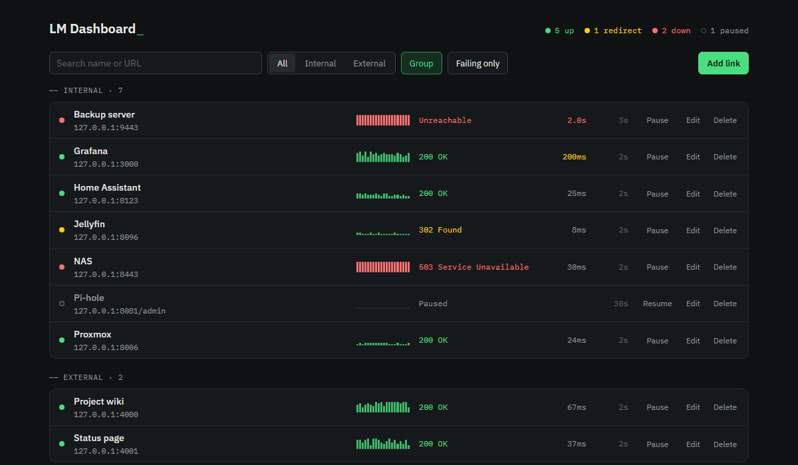
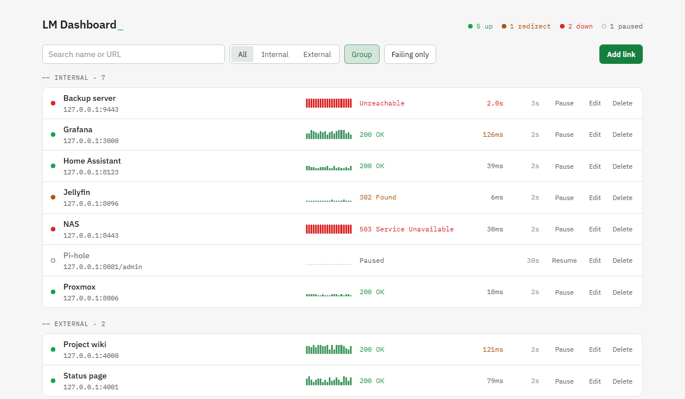
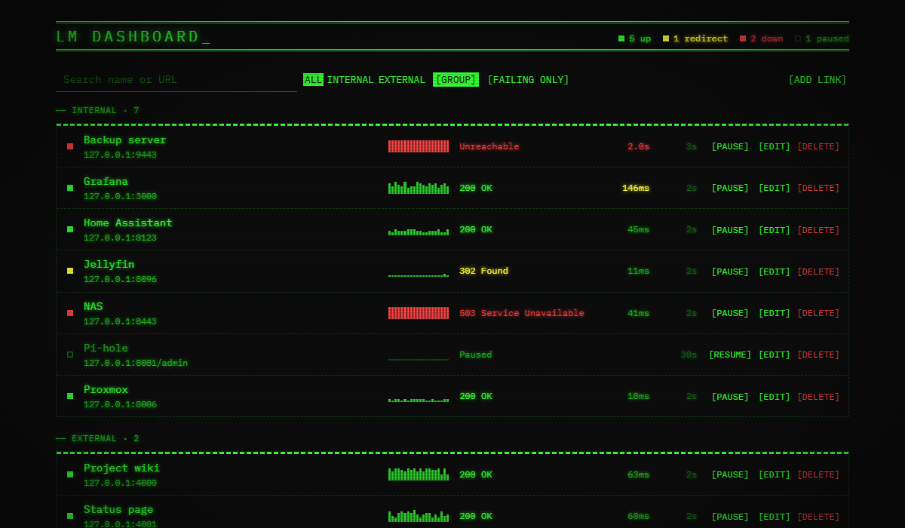

# LM Dashboard

A locally hosted start page and uptime monitor for the links on your network, with a nod to old line-mode terminals. Built with Blazor Server on .NET 10.



## Background

This project started when I came across a simulation of the first line-mode browser at [line-mode.cern.ch](https://line-mode.cern.ch/www/hypertext/WWW/TheProject.html), and it brought back a lot of memories.

My dad worked for IBM as a COBOL programmer on System/370 mainframes. When I was much younger, he'd take me into the office on weekends. I'd sit and play Trek for hours on end, and get myself into trouble de-spooling random magnetic tape reels.

I'd also wanted to write my own locally hosted link organizer to use as a start page, but I kept putting it off because other projects always seemed to come first.

Combining the two is more than likely nostalgia. Things felt so new and fanciful back then, and I miss my dad. I miss the times we spent together in that cold, air-conditioned room, blowing up Klingons.

The original green-screen look is still here as the Classic theme, scanlines and all. It's far from how those old displays really looked (colors? only if it's green!), and after a while I wanted something a bit more modern. The dark and light themes keep a few nods to it, like the monospace data and the blinking cursor, without the CRT effects.

I don't really expect anyone other than me to use this. It's a way to hold on to a little bit of something from decades past. It fits my needs for now, and I'm not sure how much further I'll take it.

## What it does

- Keeps your links on one page, each marked as internal or external. Clicking a link opens it in a new tab.
- Checks each link on its own interval and shows the HTTP status, the response time, and a graph of the last 20 checks, with failed checks in red.
- Shows at the top how many links are up, redirecting, down, waiting for a first check, or paused.
- Filters by type, groups internal and external links, shows only failing links, and searches by name or URL.
- Comes with dark, light, and Classic themes. Classic is the green-phosphor look the project started with, with optional scanlines and vignette and a brightness slider.

## Themes

Dark is the default. The Theme button at the bottom of the page cycles through Light and Classic.

| Light | Classic |
| --- | --- |
|  |  |

## How checks work

Each check is an HTTP GET. The dashboard records the status code as soon as the response headers arrive and gives up after 10 seconds.

- Redirects aren't followed, so a 301 or 302 shows up as a redirect instead of as the status of the page it points to.
- Internal links accept self-signed certificates, which home-lab services often use. External links get full certificate validation, so an expired or invalid certificate shows up as a failure.
- New links are checked every 30 seconds if they're internal and every 5 minutes if they're external. You can change the interval for each link, down to 1 second.

Check history lives in memory, so it starts over when the app restarts. Links and settings are saved to disk.

## Running it locally

You'll need the [.NET 10 SDK](https://dotnet.microsoft.com/download/dotnet/10.0).

```bash
git clone https://github.com/jmwny/LMDashboard.git
cd LMDashboard
dotnet run --project LMDashboard --launch-profile http
```

Then open http://localhost:5264.

Links and display settings are saved as `links.json` and `preferences.json` in a `Data` folder under the app's content root. With `dotnet run` that's `LMDashboard/Data`. For a published build it's the folder the app runs from.

## Allowed addresses

The dashboard only answers requests addressed to a host name or IP address you've allowed. This keeps a malicious website from reaching it through your browser with DNS rebinding. Both lists are in `appsettings.json`:

```json
"HostAccess": {
  "Hosts": [ "localhost" ],
  "Networks": [ "10.5.1.0/24", "127.0.0.0/8", "::1/128" ]
}
```

Change `Networks` to match your LAN, and add any host name you use to reach the dashboard to `Hosts`. Requests to any other address get a 400 error.

## Installing on Linux

Run one of the publish commands below from the repo folder on any machine with the .NET 10 SDK, then copy the `publish` folder to the server. That copy is the install folder the rest of this section calls `[INSTALL/BINARY DIR]`.

### Option 1: .NET on the server

The server needs the ASP.NET Core 10 runtime, and the app runs through `dotnet`.

```bash
dotnet publish LMDashboard -c Release -o publish
```

The service file below is set up for this option. Its `ExecStart` uses `/usr/share/dotnet/dotnet`. Run `command -v dotnet` on the server and use that path instead if it's different. Ubuntu's own packages install it as `/usr/bin/dotnet`.

### Option 2: self-contained

The build includes the .NET runtime, so the server doesn't need .NET installed. Publish for the server's architecture: `linux-x64` if `uname -m` prints `x86_64`, or `linux-arm64` if it prints `aarch64`.

```bash
dotnet publish LMDashboard -c Release -r linux-x64 --self-contained -o publish
```

After copying the folder to the server, mark the program as executable. Copying from Windows drops that permission, and without it systemd fails with status `203/EXEC`.

```bash
chmod +x [INSTALL/BINARY DIR]/LMDashboard
```

In the service file, change `ExecStart` to run the program directly:

```
ExecStart=[INSTALL/BINARY DIR]/LMDashboard
```

### Service file

Here's the systemd service file I use. Replace the [BRACKETED] values with ones for your system, and make sure `[USER]` can write to the install folder, since that's where the `Data` folder goes.

```
[Unit]
Description=LMDashboard - Web Link Organizer
After=network.target

[Service]
WorkingDirectory=[INSTALL/BINARY DIR]
ExecStart=/usr/share/dotnet/dotnet [INSTALL/BINARY DIR]/LMDashboard.dll
Restart=always
RestartSec=10
KillSignal=SIGINT
SyslogIdentifier=lmdashboard
User=[USER]
Group=[GROUP]

# Environment
# Environment=ASPNETCORE_ENVIRONMENT=Production
Environment=DOTNET_PRINT_TELEMETRY_MESSAGE=false
Environment=DOTNET_ROOT=/usr/share/dotnet
Environment=ASPNETCORE_URLS=http://0.0.0.0:5000

# Security hardening
NoNewPrivileges=true
PrivateTmp=true

[Install]
WantedBy=multi-user.target
```

Save it as `/etc/systemd/system/lmdashboard.service`, then start it:

```bash
sudo systemctl daemon-reload
sudo systemctl enable --now lmdashboard
```

There's no login, so anyone who can reach the dashboard can add, edit, and delete links. I wrote it as an internal-only tool and wouldn't expose it to the internet.

## License

LM Dashboard is released under the [MIT License](LICENSE). The bundled IBM Plex Sans and IBM Plex Mono fonts are under the SIL Open Font License. See [OFL.txt](LMDashboard/wwwroot/fonts/OFL.txt).
